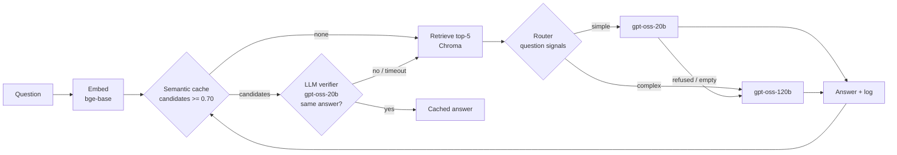
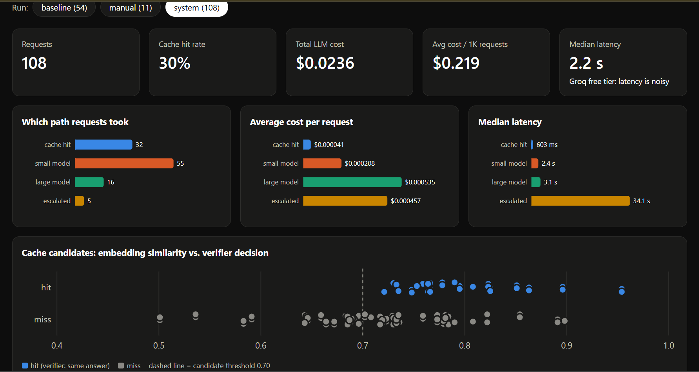

# RAG with LLM-verified semantic cache and cost-aware routing

A question-answering service over the [GitLab Handbook](https://handbook.gitlab.com/) that cuts LLM cost by
caching answers to *semantically* repeated questions and sending simple questions to a smaller model.
Every design choice here was measured, including the ones that did not work.

**Result on a 54-question eval:** 34% lower LLM cost than always calling the large model, with no measurable
quality loss (89% vs 91% of answers graded as correctly answering the question).

## Architecture



- **Semantic cache, two stages.** Embedding search finds candidate past questions (cheap, loose threshold).
  A small LLM then decides in one call which candidate, if any, has the same answer. The verifier has a
  5-second budget; on timeout or error the request is treated as a miss, so the cache can slow a request
  down but never return an unverified answer.
- **Router.** Keyword, multi-part and length signals send comparison/why/explain questions to the large
  model and everything else to the small one. No extra LLM call.
- **Cascade.** If the small model refuses ("I don't know") or returns nothing, the same context goes to the
  large model. Refusals are never cached.
- **Logging.** Every request is written to SQLite with its path, tokens, cost and a latency breakdown
  (embed / cache / retrieval / LLM). `dashboard.py` turns it into a single-file HTML dashboard.

## Results

54 questions: 20 groups of 2-3 paraphrases, deliberate near-miss traps ("enter PTO" vs "cancel PTO"),
and 8 complex questions. **Baseline** = no cache, every question to `gpt-oss-120b`.
**System** = cache + router + cascade.

| Metric | Baseline | System | Change |
|---|---|---|---|
| Total LLM cost | $0.0204 | $0.0134 | **-34%** |
| Answers graded PASS | 49 / 54 (91%) | 48 / 54 (89%) | -1 answer |
| Cache hit rate | - | 24% (50% on paraphrased questions) | |
| Wrong cache hits | - | 1 / 13 | |
| Cache misses routed to small model | - | 66% | |

**Quality.** An LLM judge (`gpt-oss-120b`) grades every answer from both runs on its own:
does it directly answer the question as asked (PASS/FAIL)? Five of the six system failures are questions the
baseline also fails, because the needed facts (e.g. exact SLA response times) are not in the indexed subset
of the handbook. The one system-only failure was an empty response from the small model; empty answers now
trigger the cascade (fixed after this eval run).

**Latency did not improve, and that is a finding.** Groq serves `gpt-oss-120b` in ~1.3 s, so the cache's
verification call costs about as much time as answering: median cache hit 1.7 s vs 1.5 s for the baseline.
On free-tier Groq, queueing also produced 25-48 s outliers in *both* runs, so p95 numbers are not meaningful.
With a fast inference provider, an LLM-verified semantic cache saves money, not time. With a slower or more
expensive model the trade-off would change, and the per-stage latency logs make that easy to measure.



`python dashboard.py` builds this from the request log. The bottom chart is the core finding in one picture:
many cache candidates above the 0.70 similarity line are correctly rejected by the verifier.

## What didn't work (and the numbers behind it)

These experiments are in `experiments/`.

1. **An embedding threshold alone gives wrong answers.** With `bge-base-en-v1.5`, "How do I enter PTO in
   Workday?" vs "How do I **cancel** PTO in Workday?" scores **0.866**, while true paraphrases score
   **0.70-0.82**. No threshold separates them: across 9 labeled pairs, the lowest same-meaning pair (0.704) is below
   the highest different-meaning pair (0.866). Embeddings measure *same topic*, not *same answer*.
2. **Cross-encoders didn't fix it.** Quora duplicate-question cross-encoders (`quora-distilroberta-base`,
   `quora-roberta-base`) scored almost every pair near 0, including clear paraphrases like
   "PTO" vs "vacation days". Their idea of "duplicate" is too literal.
3. **An LLM verifier did.** `gpt-oss-20b` asked "would one answer fully answer both questions?" got
   **9 / 9** labeled pairs right, including the traps. In the full eval: 1 wrong hit out of 13.
4. **The first LLM-judge design was unreliable.** Comparing each system answer to the baseline answer
   produced "WORSE" for near-identical texts and ignored baseline mistakes. Switching to independent
   PASS/FAIL grading of both runs fixed this.
5. **Cached refusals spread.** Before the cascade, three small-model "I don't know" answers were cached and
   served to five paraphrased questions. Refusals are now filtered from the cache and escalated.

## Run it

Requires Python 3.11+ and a free [Groq API key](https://console.groq.com/keys).

```bash
python -m venv venv && venv\Scripts\activate        # Windows
pip install -r requirements.txt

# 1. Data: two sections of the GitLab handbook
git clone --depth 1 --filter=blob:none --sparse https://gitlab.com/gitlab-com/content-sites/handbook.git
cd handbook && git sparse-checkout set content/handbook/people-group content/handbook/support && cd ..
#    copy handbook/content/handbook/people-group and /support into ./data/

# 2. Index (chunk + embed into Chroma)
python ingest.py

# 3. API  ->  http://127.0.0.1:8000/docs
set GROQ_API_KEY=...
uvicorn app:app

# 4. Dashboard  ->  writes dashboard.html and opens it
python dashboard.py

# 5. Eval (server running, ~35 min on the free tier)
python eval/run_eval.py --run baseline
python eval/run_eval.py --run system
python eval/judge.py
```

`POST /ask` takes `{"question": "...", "use_cache": true, "use_router": true}`; `GET /stats` returns hit
rate, cost and latency percentiles; `DELETE /cache` clears the cache (do this after re-ingesting).

## Project layout

| File | Purpose |
|---|---|
| `ingest.py` | Read markdown, strip Hugo front matter, chunk by heading, embed, write to Chroma |
| `app.py` | FastAPI service: cache -> retrieval -> router -> LLM -> log |
| `cache.py` | Two-stage semantic cache and refusal filter |
| `router.py` | Question-signal router |
| `logger.py` | SQLite request log and Groq pricing |
| `dashboard.py` | Builds `dashboard.html` from the request log and eval summary (standard library only) |
| `eval/` | Question set, runner, LLM judge, results |
| `experiments/` | Embedding, cross-encoder and LLM-verifier comparisons |

## Limitations

- 54 questions is small; a one-answer difference in quality is within noise.
- The judge checks whether an answer addresses the question, not whether every fact is correct against
  the source.
- Router rules are hand-written for this handbook's question style.
- Latency numbers come from Groq's free tier and vary a lot between runs.
